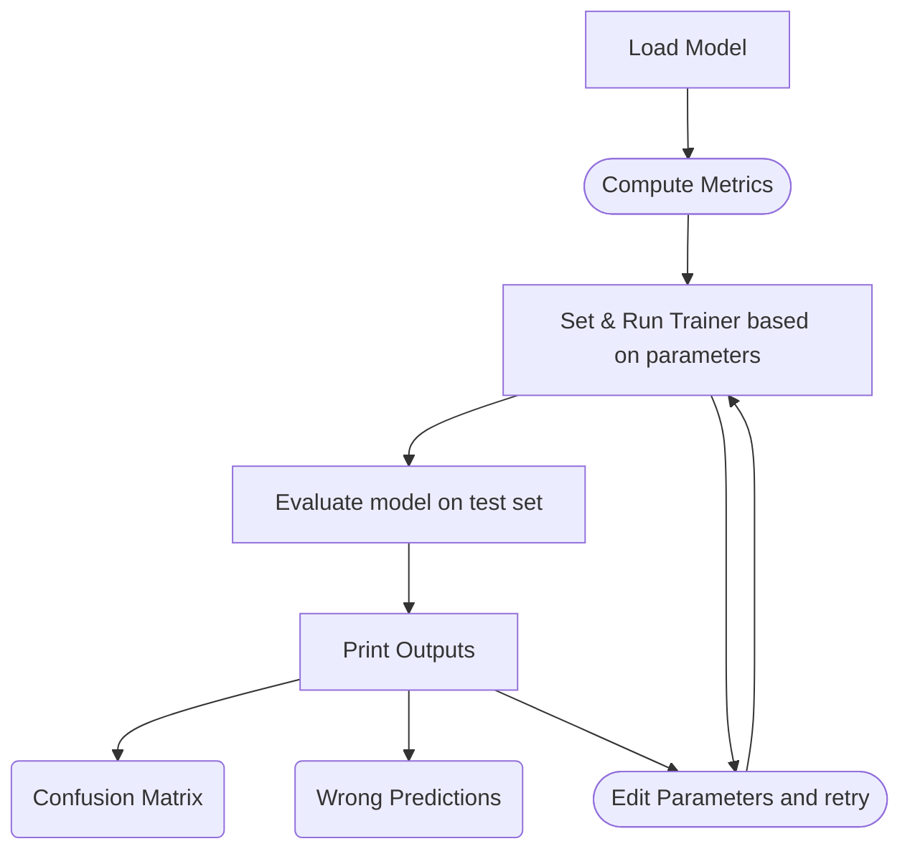
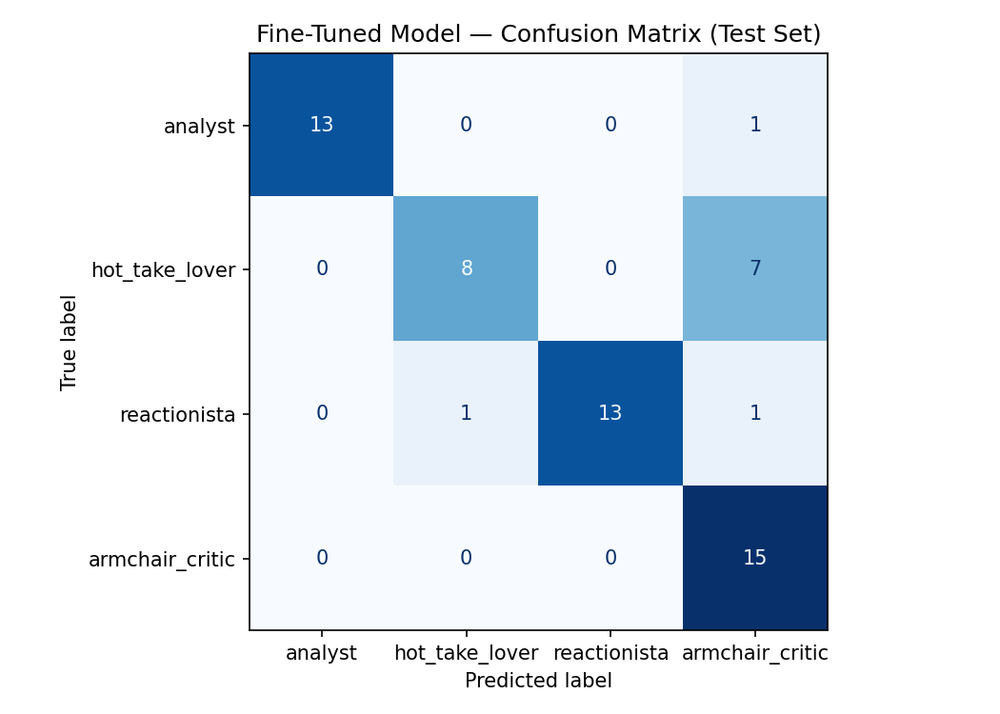

# TakeMeter

A fine-tuned text classifier that evaluates discourse quality in an online community.

**Chosen community:** Anime

- **Data Sources:** [My Anime List (MAL)](https://myanimelist.net/) and [r/anime](https://www.reddit.com/r/anime/)

- **Purpose:** Discover the how anime watchers tend to write their reviews and opinions.

- **How:** By classifying reviews and their reviewers into the below labels.

- **AI role:** An AI model will train itself on the labeled data and hopefully be able to classify anime posts as either an analysis, a hot take, a reaction, or a troll.

- **Stretch:** An untrained model will be used as a base case for classification, ensuring that the training effects classification accuracy.

## Labels

- Analyst - a structured argument backed by statistics or historical comparison, evidence that is specific and verifiable.

  - Examples:
    1) [MAL, Youjo Senki II, notweebo] This show is funny in that it get's a lot of hate from the anti-fascist crowd, and has an incredible amount of hype. And to be honest, it doesn't really deserve either of these. Ignoring the Nazi allegations(they are indeed false) what people need to remember, is that this is fundamentally a low effort Isekai. Sure, it has a very unique premise and world, and sure there's some flashy fights, but this show doesn't have a lot of depth.  
    I feel like I shouldn't need to do this, and if you feel like it's obvious this isn't about Nazi's feel free to skip, but I have read the manga, LN, and web novel for this, and can pretty confidently tell you this is not the direct equivalent of Nazi Germany some people feel it is and hate it for. If this was a propaganda piece for Nazi's I could understand getting butthurt about it, but its really not. This show is also able to officially air in Germany, and if there was anything remotely pro fascist about it, than this show wouldn't have a snowballs chance in hell to be able to air there lol. It's pretty clear through the actions of characters in the show, as well as what the author has said, that the Empire is analogous with ww1 Germany, stuck in the position of ww2 Germany. If you disagree, notice we have General 'Rudersdorf', who is almost certainly the equivalent of General Ludendorff(see the naming similarities?), who served on the Imperial German Army's Supreme Army Command(similar position). Additionally, notice the lack of mass murder, dictators, or fanatical SS units? Instead we have an Imperial family, interior lines strategy(ww1 tactics), ww1 generals, the Legadonia 'Entente Alliance'(bruh they literally managed to fit the entente in here), and trench warfare. Most definitely not the ww2 political equivalent. Then again, they get stuck in ww2 wars(and have Rommel lol) which is how the casual observer seems to be able to identify Nazi Germany as Nazi Germany, sidestepping literally everything that actually made the Nazi's, Nazi's.  
    THE GOOD
    As for my enjoyment? I actually liked this, and i am probably biased because fantasy military anime with a charming touch of geopolitics is right up my alley, nerd alert, but I feel there's a lot to like here. First off, the premise is really unique. We haven't seen any mainstream anime's try to deal with ww2 in decades, and this one adds isekai, genderbender, god, and capitalist simping to the mix. Its kinda fun. Also the MC is straight up psychotic which is also cool. His/her? backstory is being sociopathic HR guy who gets killed for being an asshole, doesn't realize it, then gets turned into a little girl and sent to ww2 for then being an asshole to god and still not noticing? Actually sounds hilarious.  
    Additionally, i think the show IS kinda funny, like it isn't a comedy by any means, but it does manage to incorporate dark humor and absurd humor which both work in this situation.
    Additionally, and this is gonna sound like a nitpick, but it actually manages to keep all the mains and sides acting like their contextually supposed to. A lot of show's have their author's thoughts and values bleed over into their characters, making them do, say, and think stuff which doesn't really align with the situation their in, and this show manages to avoid a lot of that self insert, for which i'm really glad.  
    THE MIXED
    As for the actual content of the show? It is straight up ripped from the LN. Which is good in that it follows the source material, but it does feel like copied homework without any original interpretation; and it's not even adapted all that well. If you ever feel like the pace is weird sometimes or the bits between episodes is jarring, then this is it. I can't imagine any of the budget went into story. On a side note, this is why i feel confident doing a review while only halfway through, i highly doubt their going to pull some insane trick out of their hat while moving like this lol. The only unique bit is the exact timing of when Mary Sue is annoying, and even then, that's not all that impressive. In the Web novel, the LN, and Manga she show's up at different times so it seems they were forced to just say 'screw it'  
    THE UGLY
    Now I'll still continue to like this because I like specific things and enjoyed it for the reasons above, but I'm not exactly sure I can recommend this to anyone because of how flat the characters are. Other than Tanya being a sociopathic HR guy, everyone else has next to 0 backstory, nobody changes at all except to get better at fighting, and nobody seems to have realistic human problems/emotions/development to talk about. There is nothing in the personal lives of these characters that's going to keep me pondering past their time on the screen. Which is a real shame as characters are some of THE most important parts of a story, they are literally the main device for keeping you engaged with the story. Honestly this is quite tragic.  
    The story itself, beyond ww2 countries invade each other rahhh, is kinda flat. For most people, braindead watching something in the background while they try to forget their day or do homework, this is great, for everyone else, you might have a problem. If you push it, you can see commentary on Concorde syndrome and Germany historically, or the dangers of overspecializing and being blind to alternative points of view, maybe even something about capitalism/communism, but really, this story doesn't have much of a theme. If you're watching, your here for germans and soviets killing each other, and maybe even loli's if you're weird.

    2) [r/anime, The Ribbon Hero,  alej_11]
    The Ribbon Hero is Extremely Underwhelming  
    I should preface this by saying that I am not the target audience for this movie; I am generally not a fan of the magical girl genre or shows similar to Sailor Moon.  
    However, because Osamu Tezuka is widely regarded as a legendary mangaka (very honestly I never read/watched one of his works, so I wanted to start with this), and this is considered one of his definitive works, I wanted to give it a fair shot. I went in completely blind regarding the plot, meaning my critiques aren't the result of overly high expectations—I simply wanted a compelling story. Visually and aurally, it delivers. The animation, sound design, and soundtrack are easily the strongest aspects of the film, and I genuinely enjoyed them.  
    Unfortunately, the narrative is painfully mediocre. Despite a runtime of nearly two hours, it possesses the narrative density of a one-hour feature. While fast pacing can sometimes be a positive, here it highlights the fact that nothing of substance is actually happening. Out of the entire cast, Velvet is the only character with a semblance of depth (I wasn't entirely sure of his gender, but my dub used male pronouns, so I will too). Even then, Velvet's characterization is fairly superficial, though I did appreciate that he had clear motivations and cared for the orphans. Sapphire, on the other hand, is an incredibly hollow protagonist. She offered absolutely no emotional resonance, internal conflict, or compelling character growth for the entire duration of the film.  
    The supporting cast fares even worse. I'm writing this ten minutes after the credits rolled, I had to open a separate tab just to remember their names. The treatment of Sapphire's best friend is especially egregious; the film attempts to position her as an important figure, but she is ultimately reduced to a cliché "power of friendship" trope in the final act. Zirco and Chorogi are equally frustrating. Zirco raised Sapphire for seven years and saved her from a collapsing kingdom, yet the film completely fails to establish any maternal bond between them, reducing Zirco to simple comic relief. Chorogi is given unearned, off-screen character development, inexplicably shifting from a remorseless traitor to a brave martyr. His death is an incredibly contrived attempt to inject artificial stakes into the final battle, and because he was an unlikable coward for most of the runtime, his sacrifice carries zero emotional weight.  
    Finally, the villain is completely one-dimensional. The Pope is cartoonishly evil for the sake of it. I can somewhat understand the desperate logic of sacrificing innocent souls to appease a conceptual monster in order to save the kingdom. However, when the literal chosen one is standing right in front of you, the logical choice is to let her fight first and keep the ritual as a backup plan. Instead, the Pope arrogantly ignores reason, attempts to murder the orphans anyway, and remains in denial even while Sapphire is overpowering the monster.  
    There are plenty of other flaws, but to keep this brief, I am giving it a 6.5/10. I desperately wanted to enjoy this film, but the writing is relentlessly mediocre. The only reason it scores this high is out of fairness to a genre I don't typically watch, and because the animation and soundtrack are genuinely fantastic. Honestly if it wasn't on Netflix and it came out in theatres I would have never spent 20€ and go to watch something like this.  
    Regardless, I struggle to see how this narrative earned its status as a masterpiece.  
    Before anyone starts to ask if this is made with AI, no it's not. I was genuinely so much surprised to the film I watched (as you can see not in a positive manner) that I wrote such paragraph. Normally I don't speak this formally, and I tried to not use swears, because I don't usually post my opinion online, so to avoid sounding overly offensive, I remained formal. Also English is not my native language, so please forgive me if I used unusual terms or wrong verbal forms. Uh this is all, I think, feel free to give your opinion or even flame me because I have a terrible take, I would love to see different points of view.

- Hot Take Lover - a bold, confident and some times outrageous opinion stated without a breadth of supporting evidence; a claim that might be true, and a post that asserts rather than argues.

  - Examples:
    1) [r/anime, You and I Are Polar Opposites, Kingdom_1126] I smile like a total idiot through this entire show every single Sunday. Best rom-com of the year hands down.

    2) [MAL, Frieren, TamaraZ] Wait what am I even watching. Ohhh yeah the most overrated anime ever.  
    It was boring, first season at least had something but this season takes it so down that I had to drop it.  
    Is it just me or anime are getting way too good of rates lately. If Naruto, FMAB or similar anime were to come out now they would be clean 10 I would say.  
    Yeah the story behind it is passage of time makes me wonder why does episode lasts an eternity of nothing happening. Even emotional moments or "deeper" moments are way too slow and I'm just there watching it and thinking what am I doing with my life.  
    Even from first season I didn't like the characters at all.
    Also I'm apsolutely not in love with generic isekai animation, I like it is done in a bit more dreamy way but again it feels like I'm watching any generic isekai anime. Nothing is memorable and I don't get how this anime gets so much recommendations. It is so forgetable, I already forgot the first season, and went in second hoping I'll somehow gain interest but that didn't happen. Everything I remember about first season is Himmel and it is at the same time best part of it.
    Also why are conversations so bland even though they should be kind of deep and emotional. Same with humor, it doesn't exist but there is again some try hard boring call it "funny" scenes.
    Overall this anime is biggest disappointment of the last 3 decades. There were worse anime, but none of them were praised before this. They were pushed under the rug. I want to give it a 1, but I will go with two since i do know a lot of people kind of liked it. I don't know anyone who really liked it to give it a 10 so this rating feels unreal to me.

- Reactionista - an immediate emotional response to a specific event. Almost no arguments, expressing a feeling in the moment. Usually right after finishing a series or episode.

  - Examples:
    1) [r/anime, samby69] Was hoping a little more would happen this episode but animation was great nonetheless. Can they not place something in front of the kids to block their path??? Loved the snow moss head moment with zoro and sanji… and the light punch from luffy to knock out Loki

    2) [MAL, Death Note, Wow-A-Leaf] [quote=Wow-A-Leaf message=4015257]Misa's lost half her life twice for nothing, Light really is a prick.  
    What will Light do with Misa now that she's useless to him?  
    I think he'd kill her if he could, but it wouldn't really be a wise move I guess.  
    I'm glad those moron Kira supporters are gone. One million yen? Real subtle.  
    Near really annoys me. In the last episode he was 7% sure that Light was Kira. Sound familiar? Oh yeah, L was the EXACT SAME amount sure that Light was Kira. Why the exact same percentage?
    I don't particularly like Mello either. It's the whole chocolate thing. Only L can get away with always eating!  
    The 'new guy' looks interesting. It'd be too bad if a 'mutiny' occurred and he accidently/purposely killed Light.  
    Although Light is a complete prick, I can't completely hate him for some reason. I've been on 'Team Light' for most of the series even though I completely disagree with his views. DN is confusing like that. I spend the whole time trying to figure out which side I'm on..  
    Eliminate!

- armchair critic - a casual opinion that is not too structured or loose. Can make fun of something contextually relevant, or critic a a series in layman terms; a casual review.

  - Examples:
    1) [MAL, Smoking Behind the Supermarket with You, MongoDB] originally, i thought this show was a hentai. it looks like a hentai with the art/animation quality. I watched a few episodes but it was a very difficult watch and there is nothing really interesting going on story wise either. The story basically could be the same as a hentai if you think about it too. It's a very simple show and also very unrealistic. It also promotes unhealthy habits like smoking and staying up late so I hope it's not kids watching this. Also, the MC is so clueless and dense throughout the whole thing it is actually insufferable to watch  
    I wonder what type of person enjoys this show and why? I suspect it's someone that has never experienced romance so that they could find this strange type of romance dynamic to be believable and actually enjoy it. For me, it was not possible to watch without cringing and wincing. Romance is generally pretty bad in anime, but this one might take the cake

    2) [r/anime, Grand Blue: Dreaming, neovenator250] What are you talking about? Gran Blue is an isekai. Reincarnated in a world where people can survive drinking an amount of alcohol that would kill a bull elephant

## Workspace

- Utilized this repositiory to choose community and plan out labels in `planning.md`

- [Google Colab](https://colab.research.google.com/drive/1WvQlXC5p_0PKzOfASEZ-SjlBkKiIHyf3?usp=sharing) was used to split data set (`data_set.csv`) into training, testing, validation and more.

## Distributions

Total examples: 392

Label distribution:

|label|Count|
|-----|-----|
|armchair_critic|100|
|reactionista|100|
|hot_take_lover|98|
|analyst|94|

### Splits

Train: 274 examples
Validation: 59 examples
Test: 59 examples

Train label distribution:

|label|Count|
|-----|-----|
|reactionista|70|
|armchair_critic|70|
|hot_take_lover|68|
|analyst|66|

Test label distribution:

|label|Count|
|-----|-----|
|armchair_critic|15|
|hot_take_lover|15|
|reactionista|15|
|analyst|14|

## Fine-Tuning Pipeline

Here is a visual representation of how fune-tuning can be run to train the chosen model

chosen model: distilbert-base-uncased model



## Baseline Comparison (Trained vs. Untrained)

| Model | Accuracy |
| ------- | -------- |
| Zero-shot baseline (Groq) | 0.923 |
| Fine-tuned DistilBERT | 0.831 |

**Fine-tuning regression:** 0.093

## Evaluation Report and Error Analysis

To preface my Groq zero-shot baseline was partial with 33 non-parseable responses becasue my prompt was too large and I misplelled a label (armchair_critic).

I was given 429 API Errors like this:

``` python
 'Rate limit reached for model `llama-3.3-70b-versatile` in organization `org_01kt9mgwyye06b5a2yqd3qhtjg` service tier `on_demand` on tokens per day (TPD): Limit 100000, Used 98467, Requested 1776. Please try again in 3m29.952s. Need more tokens? Upgrade to Dev Tier today at https://console.groq.com/settings/billing', 'type': 'tokens', 'code': 'rate_limit_exceeded'
```

The full prompt that caused this error is at the bottom of this README.md in the section titled [Erroneous Prompt](#erroneous-prompt), under the misc section.

Despite this error, here are the in-depth details of the baseline run and my fine-tuned run against the testing split:

### Groq Baseline (Untrained)

🎯 Baseline accuracy: 0.923  (evaluated on 26/59 parseable responses)

Per-class metrics (baseline):

| label | precision | recall | f1-score | support |
| ----- | --------- | ------ | -------- | ------- |
| analyst | 1.00 | 1.00 | 1.00 | 12 |
| hot_take_lover | 0.00 | 0.00 | 0.00 | 1 |
| reactionista | 0.86 | 1.00 | 0.92 | 12 |
| armchair_critic | 0.00 | 0.00 | 0.00 | 1 |

| metric | precision | recall | f1-score | support |
| ----- | --------- | ------ | -------- | ------- |
| accuracy | - | - | 0.92 | 26 |
| macro avg | 0.46 | 0.50 | 0.48 | 26 |
| weighted avg | 0.86 | 0.92 | 0.89 | 26 |

### distilbert-base-uncased (Trained)

Adjusted hyperparameters for my model run:

```python
num_train_epochs=5,
per_device_train_batch_size=25,
per_device_eval_batch_size=50,
```

The purpose of the adjustment is to increase the model's accuracy. The purpose of the baseline is to see the work of my data, so I want to make sure my model benefits from the training data.

#### Epoch Showcase

Here are the results of my fine-tuning. Accuracy increased the more training attempts the model was given, up to a point.

|Epoch|Training Loss|Validation Loss|Accuracy|
|-----|-------------|---------------|--------|
|1|1.383392|1.372990|0.254237|
|2|1.348627|1.317716|0.559322|
|3|1.271565|1.181951|0.728814|
|4|1.107261|0.926515|0.813559|
|5|0.838836|0.690908|0.813559|

#### Results

🎯 Fine-Tuned model accuracy: 0.831

Per-class metrics (fine-tuned model):

| label | precision | recall | f1-score | support |
| ----- | --------- | ------ | -------- | ------- |
| analyst | 1.00 | 0.93 | 0.96 | 14 |
| hot_take_lover | 0.89 | 0.53 | 0.67 | 15 |
| reactionista | 1.00 | 0.87 | 0.93 | 15 |
| armchair_critic | 0.62 | 1.00 | 0.77 | 15 |

| metric | precision | recall | f1-score | support |
| ----- | --------- | ------ | -------- | ------- |
| accuracy | - | - | 0.83 | 59 |
| macro avg | 0.88 | 0.83 | 0.83 | 59 |
| weighted avg | 0.88 | 0.83 | 0.83 | 59 |

##### Confusion Matrix



##### Wrong Predictions: 10/59

--- #1 ---

Text:      Fate fights look pretty, but I couldn't care less about any of the characters involved.

True:      hot_take_lover

Predicted: armchair_critic  (confidence: 0.36)

--- #2 ---

Text:      Lelouch is a terrible strategist who only survived because every other character in Code Geass has negative IQ.

True:      hot_take_lover

Predicted: armchair_critic  (confidence: 0.33)

--- #3 ---

Text:      MEGUMIN'S EXPLOSION SPELL ANIMATION IS GETTING BETTER EVERY SINGLE EPISODE LMAO YES!

True:      reactionista

Predicted: hot_take_lover  (confidence: 0.29)

--- #4 ---

Text:      It's getting a 1 solely because someone actually allowed Mori Calliope to put her pathetic excuse for "music" in this show. One of the sequences that features her "music" is completely unskippable, wh...

True:      hot_take_lover

Predicted: armchair_critic  (confidence: 0.36)

--- #5 ---

Text:      Katana Man vs Denji on the train was so hype! The sound design was crazy good!

True:      reactionista

Predicted: armchair_critic  (confidence: 0.30)

--- #6 ---

Text:      Snoozefest, nothing happens and when something happens it's obvious, cheap and insignificant, by the way 1/4(sometimes even half) of the most episodes is flashbacks to the other mediocre characters th...

True:      hot_take_lover

Predicted: armchair_critic  (confidence: 0.38)

--- #7 ---

Text:      This is the worst shit I've ever watched in my life. School Days is better than this Cocomelon-level show.
Watching paint dry is more exiting and intriguing than watching this slop that dares to call ...

True:      hot_take_lover

Predicted: armchair_critic  (confidence: 0.36)

--- #8 ---

Text:      I would have never expected to find this anime, came across on youtube and holy, it's so good. The animation, effects are smooth af. The first episode's first few scenes itself got me hooked. But it's...

True:      analyst

Predicted: armchair_critic  (confidence: 0.40)

--- #9 ---

Text:      SAO Season 1 first arc was actually a 10/10 and everything that came after ruined its legacy.

True:      hot_take_lover

Predicted: armchair_critic  (confidence: 0.31)

--- #10 ---

Text:      Ayanokoji is just cringey edgelord bait for middle schoolers.

True:      hot_take_lover

Predicted: armchair_critic  (confidence: 0.36)

## Reflections

### Wrong Prediction & Model Analysis

The missed cases (shown [above](#wrong-predictions-1059)) are likely caused by th eoverlapping nature of the armchair_critic label. It is for more casual posts and reviews that shy away from the structuredness of an analyst's post, the directness of a hot take lover's post, and the recent energy of an reactionista. These all had confidence scores 40% and under.

My solution is to edit the hyper peramters and be more specific when labeling the chosen data points.

### AI Usage

#### Scenario 1: Clarifying Questions

**Input:** How can I properly format a csv if one of the labels is meant to hold paragraphs that include commas? Is there an already tried-and-true way to do so?

**Action:** Reformat csv entries so that data is able to be read properly.

#### Scenario 2: Data Procurement Becomes too Time Consuming

**Input:** could you help me fill the rest of this csv fill? objective is to have label counts of 50 analyzer, 50 hot take lover, 50 armchair critic, and 50 reactionista. Label details are in planning.md. Let me know if you want a website to check out.

**Action**: After procuring about 100 myself, I offloaded efforts to AI and extracted pieces that fit. I received more than I asked for, for clarity.

### Spec (planning.md)

The Spec helped me out tremendously. I got to plan my version of the TakeMeter project effortlessly, only needing to choose a domain and fitting labels. Data procurement was of course the most time consuming, and having planning.nd already filled out eith examples for aeach label helped me in discerning wich post/comment is which.

## Misc

### Erroneous Prompt

Here is the prompt that used up the Groq credits. It was 7824 characters long:

```python
SYSTEM_PROMPT = """

You are classifying Reviews/comments from the Anime Community.

Assign each post to exactly one of the following categories.


Analyst: a structured argument backed by statistics or historical comparison, evidence that is specific and verifiable.

Example: "This show is funny in that it get's a lot of hate from the anti-fascist crowd, and has an incredible amount of hype. And to be honest, it doesn't really deserve either of these. Ignoring the Nazi allegations(they are indeed false) what people need to remember, is that this is fundamentally a low effort Isekai. Sure, it has a very unique premise and world, and sure there's some flashy fights, but this show doesn't have a lot of depth.


I feel like I shouldn't need to do this, and if you feel like it's obvious this isn't about Nazi's feel free to skip, but I have read the manga, LN, and web novel for this, and can pretty confidently tell you this is not the direct equivalent of Nazi Germany some people feel it is and hate it for. If this was a propaganda piece for Nazi's I could understand getting butthurt about it, but its really not. This show is also able to officially air in Germany, and if there was anything remotely pro fascist about it, than this show wouldn't have a snowballs chance in hell to be able to air there lol. It's pretty clear through the actions of characters in the show, as well as what the author has said, that the Empire is analogous with ww1 Germany, stuck in the position of ww2 Germany. If you disagree, notice we have General 'Rudersdorf', who is almost certainly the equivalent of General Ludendorff(see the naming similarities?), who served on the Imperial German Army's Supreme Army Command(similar position). Additionally, notice the lack of mass murder, dictators, or fanatical SS units? Instead we have an Imperial family, interior lines strategy(ww1 tactics), ww1 generals, the Legadonia 'Entente Alliance'(bruh they literally managed to fit the entente in here), and trench warfare. Most definitely not the ww2 political equivalent. Then again, they get stuck in ww2 wars(and have Rommel lol) which is how the casual observer seems to be able to identify Nazi Germany as Nazi Germany, sidestepping literally everything that actually made the Nazi's, Nazi's.


THE GOOD

As for my enjoyment? I actually liked this, and i am probably biased because fantasy military anime with a charming touch of geopolitics is right up my alley, nerd alert, but I feel there's a lot to like here. First off, the premise is really unique. We haven't seen any mainstream anime's try to deal with ww2 in decades, and this one adds isekai, genderbender, god, and capitalist simping to the mix. Its kinda fun. Also the MC is straight up psychotic which is also cool. His/her? backstory is being sociopathic HR guy who gets killed for being an asshole, doesn't realize it, then gets turned into a little girl and sent to ww2 for then being an asshole to god and still not noticing? Actually sounds hilarious.

Additionally, i think the show IS kinda funny, like it isn't a comedy by any means, but it does manage to incorporate dark humor and absurd humor which both work in this situation.

Additionally, and this is gonna sound like a nitpick, but it actually manages to keep all the mains and sides acting like their contextually supposed to. A lot of show's have their author's thoughts and values bleed over into their characters, making them do, say, and think stuff which doesn't really align with the situation their in, and this show manages to avoid a lot of that self insert, for which i'm really glad.


THE MIXED

As for the actual content of the show? It is straight up ripped from the LN. Which is good in that it follows the source material, but it does feel like copied homework without any original interpretation; and it's not even adapted all that well. If you ever feel like the pace is weird sometimes or the bits between episodes is jarring, then this is it. I can't imagine any of the budget went into story. On a side note, this is why i feel confident doing a review while only halfway through, i highly doubt their going to pull some insane trick out of their hat while moving like this lol. The only unique bit is the exact timing of when Mary Sue is annoying, and even then, that's not all that impressive. In the Web novel, the LN, and Manga she show's up at different times so it seems they were forced to just say 'screw it'


THE UGLY

Now I'll still continue to like this because I like specific things and enjoyed it for the reasons above, but I'm not exactly sure I can recommend this to anyone because of how flat the characters are. Other than Tanya being a sociopathic HR guy, everyone else has next to 0 backstory, nobody changes at all except to get better at fighting, and nobody seems to have realistic human problems/emotions/development to talk about. There is nothing in the personal lives of these characters that's going to keep me pondering past their time on the screen. Which is a real shame as characters are some of THE most important parts of a story, they are literally the main device for keeping you engaged with the story. Honestly this is quite tragic.


The story itself, beyond ww2 countries invade each other rahhh, is kinda flat. For most people, braindead watching something in the background while they try to forget their day or do homework, this is great, for everyone else, you might have a problem. If you push it, you can see commentary on Concorde syndrome and Germany historically, or the dangers of overspecializing and being blind to alternative points of view, maybe even something about capitalism/communism, but really, this story doesn't have much of a theme. If you're watching, your here for germans and soviets killing each other, and maybe even loli's if you're weird."

Hot Take Lover: a bold, confident and some times outrageous opinion stated without a breadth of supporting evidence; a claim that might be true, and a post that asserts rather than argues.

Example: "I smile like a total idiot through this entire show every single Sunday. Best rom-com of the year hands down."

Reactionista: an immediate emotional response to a specific event; Almost no arguments, expressing a feeling in the moment

Example: "Was hoping a little more would happen this episode but animation was great nonetheless. Can they not place something in front of the kids to block their path??? Loved the snow moss head moment with zoro and sanji… and the light punch from luffy to knock out Loki"

Armchair Critic: a casual opinion that is not too structured or loose. Can make fun of something contextually relevant, or critic a a series in layman terms; a casual explanation.

Example: originally, i thought this show was a hentai. it looks like a hentai with the art/animation quality. I watched a few episodes but it was a very difficult watch and there is nothing really interesting going on story wise either. The story basically could be the same as a hentai if you think about it too. It's a very simple show and also very unrealistic. It also promotes unhealthy habits like smoking and staying up late so I hope it's not kids watching this. Also, the MC is so clueless and dense throughout the whole thing it is actually insufferable to watch

I wonder what type of person enjoys this show and why? I suspect it's someone that has never experienced romance so that they could find this strange type of romance dynamic to be believable and actually enjoy it. For me, it was not possible to watch without cringing and wincing. Romance is generally pretty bad in anime, but this one might take the cake

Respond with ONLY the label name.

Do not explain your reasoning.

Valid labels:

Analyst
Hot Take Lover
Reactionista
Arcmchair Critic
"""
```
